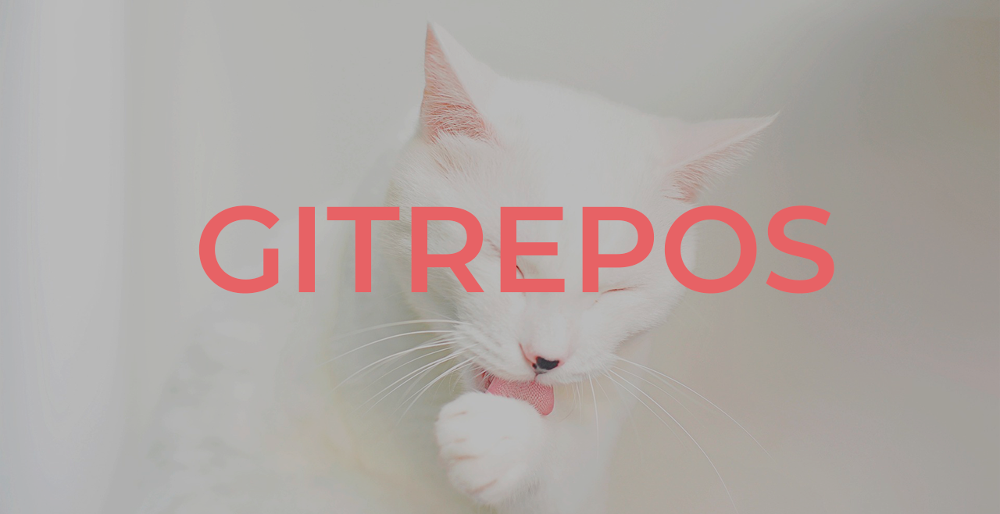

  

## What is GITREPOS

GITREPOS is a Python script that simplifies the automation of tasks related to creating and deleting repositories on GitHub and GitLab. Additionally, it provides the functionality to connect these repositories in a "mirror," enabling changes made in one repository to automatically reflect in the other.

## What is in GITREPOS repository

- **gitrepos.py**: This is the main script what create and configurate or remove the repositories.
- **gitPushMirror.sh**: You need copy this script on the repository. This script is only for run `git push` command on both repositories.
- **requirements.txt**: This file contain all necessary packages for run gitrepos
- **container.config.json**: This file is an example of how your .config.json (container) will look like
- **local.config.json**: This file is an example of how your .config.json (local dir repository) will look like

## How to run

:warning: **You must be installed Python 2.5 or newer and GIT 2.39 or newer on your local system** :warning:

### 1. First of all, you must create a container directory where all repositories will be stored

Ex: my container configuration

- gitlab (container)
  - gitrepos (repo1)
  - personalRepo (repo2)
  - otherRepos (repo3)

### 2. Download or clone this repository

- Download the script: `wget https://gitlab.com/Nuria_Liano/gitrepos/-/raw/main/gitrepos.py?inline=false`
- Clone the repository
  - SSH  `git clone git@gitlab.com:Nuria_Liano/gitrepos.git`
  - HTTPS  `git clone https://gitlab.com/Nuria_Liano/gitrepos.git`

### 3. Install all requirements

- Python 2.5 `pip -r requirements.txt`
- Python 3 `pip3 -r requirements.txt`

### 4. Execute script

- Python 2.5 `python gitrepos.py`
- Python 3 `python3 gitrepos.py`

### 5. Now you can use that repository and you can execute `git add` and `git commit -m ""` normally

### 6. :warning: But when you execute git push it is neccesary you run the gitPushMirror.sh

   ~~~sh
   sh gitPushMirror.sh
   ~~~

### Example of execution

1. Run gitrepos.py

~~~bash
'COMMAND'
$ python {your_path}/gitrepos.py

'OUTPUT'
Do you want remove or create new repo? r/c: c
Enter the repo name: testRepo
[SUCCESS - CHECK CONTAINER CONFIG] gitlab\.config.json loaded successfully
[SUCCESS - LOCAL CREATED] \gitlab\testRepo created successfully
Enter the repo visibility: (public/private)
[WARNING] press enter to set the repo visibility to "public"
[SUCCESS - GITLAB CREATED] testRepo created successfully
[CHECK] Go to https://gitlab.com/Nuria_Liano/testRepo.git to check it!
Enter the repo visibility: (public/private)
[WARNING] press enter to set the repo visibility to "public"
[SUCCESS - GITHUB CREATED] testRepo created successfully
[CHECK] Go to https://api.github.com/repos/NuriaLiano/testRepo to check it!
[SUCCESS - README CREATED] \gitlab\testRepo/README.md created successfully
[SUCCESS - README COMMITED] \gitlab\testRepo/README.md commited successfully
[SUCCESS - README PUSHED] Push with upstream master
[SUCCESS - MIRROR SET UP] https://github.com/NuriaLiano/testRepo set up successfully
~~~

2. Add data and files

~~~bash
touch README.md
~~~

3. Git add and git commit
  
~~~bash
'COMMAND'
$ git add README.md
$ git commit -m "update Readme"

'OUTPUT'
[master 0933f14] update Readme
 1 file changed, 47 insertions(+)

~~~

4. Git push mirror

~~~sh
'COMMAND'
$ sh gitPushMirror.sh

'OUTPUT' 
Enumerating objects: 5, done.
Counting objects: 100% (5/5), done.
Delta compression using up to 8 threads
Compressing objects: 100% (3/3), done.
Writing objects: 100% (3/3), 312 bytes | 312.00 KiB/s, done.
Total 3 (delta 1), reused 0 (delta 0), pack-reused 0
To https://gitlab.com/Nuria_Liano/gitrepos.git
   ba06cf8..c4f36cf  master -> master
Enumerating objects: 5, done.
Counting objects: 100% (5/5), done.
Delta compression using up to 8 threads
Compressing objects: 100% (3/3), done.
Writing objects: 100% (3/3), 312 bytes | 312.00 KiB/s, done.
Total 3 (delta 1), reused 0 (delta 0), pack-reused 0
remote: Resolving deltas: 100% (1/1), completed with 1 local object.
To https://github.com/NuriaLiano/gitrepos
   ba06cf8..c4f36cf  master -> master
Everything up-to-date
~~~

5. (Optional) Remove repository

~~~bash
'COMMAND'
$ python {your_path}/gitrepos.py

'OUTPUT'
Do you want remove or create new repo? r/c: r
Enter the repo name: testRepo
Are you sure you want to delete the repository? y/n: y
[SUCCESS - GITHUB DELETE] https://api.github.com/repos/NuriaLiano/testRepo deleted successfully
[SUCCESS - GITLAB DELETED] testRepo in GITLAB has been deleted
[SUCCESS - LOCAL DELETED] \gitlab\testRepo has been deleted
~~~

## What data I need

The first time you run the script it will ask for all the variables it does not find and generate the `.config.json` file both in the container and locally.

### Gitlab data

- **Username**: "Nuria_Liano"
- **Gitlab Token**: "asa7f9sd87fsg8sd987sd8g8s"

### Github data

- **Username**: "NuriaLiano"
- **Github Token**: "asa7f9sd87fsg8sd987sd8g8s"
  
## How generate mirror

The `set_up_gitlab_github_mirror` function is responsible for setting up a mirror between a GitLab repository and a GitHub repository. Here's the step-by-step of how it does this setup:

- **Gets the necessary variables**: the function starts by getting the paths to the directories and files needed for the mirror setup. It uses the create_path function to create the paths to the local directories and the configuration file local_path_config. In addition, it gets the URLs of the GitLab and GitHub repositories, as well as the GitHub access token, from the container_path_config configuration file.
- **Add the GitHub repository as a remote**: Use the gitpython library to add the GitHub repository as a remote named "github" to the local GitLab repository. This is accomplished with the line gitlabRepo.create_remote('github', gh_repo_url). This way, the local GitLab repository is configured to push changes to the GitHub repository via the remote "github".
- **Configure the mirror in GitLab**: Use the Git command line tool to configure the mirror between the GitLab repository and the GitHub repository. This is done through the following lines of code:

    ~~~py
    gitlabRepo.git.remote('set-url', '--push', 'github', gh_repo_url)
    gitlabRepo.git.remote('set-url', '--push', '--add', 'github', gl_repo_url)
    ~~~

    These lines set the push URLs for the remote "github" so that changes made to the local GitLab repository are automatically pushed to the GitHub repository. gh_repo_url represents the URL of the GitHub repository and gl_repo_url represents the URL of the GitLab repository.
- **Synchronise changes**: The function gets the name of the active branch in the local GitLab repository by default_branch = gitlabRepo.active_branch.name. It then performs a pull operation from the GitLab repository to get the most recent changes to the active branch, using the line gitlabRepo.remotes.origin.pull(default_branch). It then performs a push operation on the "github" remote to push the changes to the GitHub repository, using the GitHub access token for authentication:

    ~~~py
    gitlabRepo.git.push('--all', 'github', **{'o': f'oauth2accesstoken:{gh_token}'})
    ~~~

## Errors and suggestions

If you find a problem with the code or have implemented an improvement please open an issue.

## License

All content in this repository is licensed under a [Creative Commons Attribution-NonCommercial 4.0 International Public License](./LICENSE)

## Contact

You can write to me at <hola@nurialiano.es>

Visit my profiles or my website

    

        
        
        
        
        
        
    

---

    
Desarrollado en    con mucho  y 

