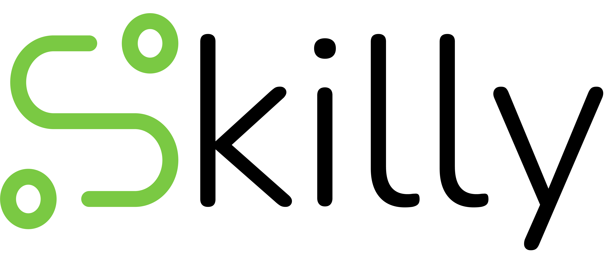

# 

    <h1>Academia online de informática</h1>

    <h2 style="margin-right: 20px;"><a style="color:#7AC943;" href="https://www.skilly.es">skilly.es</a></h2>
    <h2><a style="color:#7AC943;" href="mailto:hola@skilly.es">hola@skilly.es</a></h2>

## Indice

1. 
   1. [Indice](#indice)
   2. [Qué es Skilly](#qué-es-skilly)
      1. [Cómo son las clases](#cómo-son-las-clases)
   3. [Que hay en el repo?](#que-hay-en-el-repo)
   4. [Puedo usar el contenido?](#puedo-usar-el-contenido)
   5. [Contacto](#contacto)

## Qué es Skilly

Skilly es una academia online de informática que rompe con el molde tradicional. No sólo ofrecemos cursos sobre una amplia variedad de tecnologías de forma gratuita, sino que también ponemos a tu disposición la opción de contar con un profe especialista. Esta combinación permite a los estudiantes no solo aprender a su propio ritmo, sino también obtener una tutorización personalizada para consolidar sus conocimientos y adquirir unas bases sólidas.

Nuestro lema, "No hay compromiso, solo oportunidades de crecimiento", refleja nuestra filosofía. Si decides aprovechar la experiencia de nuestras clases particulares, tienes la libertad de cancelar en cualquier momento. Valoramos tu autonomía y entendemos que cada persona tiene un ritmo y necesidades diferentes.

Y no sólo nos dirigimos a estudiantes: los profesores que quieran ampliar sus conocimientos o preparar alguna materia también encontrarán en Skilly una herramienta esencial. Además, si estás embarcándote en un proyecto, TFG o TFM, ofrecemos tutorización especializada para acompañarte en cada etapa.

En Skilly, creemos en el potencial ilimitado de cada persona y trabajamos para desbloquear las oportunidades de crecimiento para todos.

### Cómo son las clases

Las clases en Skilly están diseñadas para ser todo menos convencionales. Son dinámicas, interactivas y, sobre todo, centradas en el alumno. Creemos firmemente que el aprendizaje ocurre mejor cuando el alumno es el protagonista de su educación, y es precisamente este enfoque el que adoptamos.

Decimos adiós a los "powerpoints aburridos" y en su lugar adoptamos una metodología única: "Modo historia". Esta técnica, desarrollada por nosotros, se basa en prácticas que emulan situaciones y desafíos de la vida real en el mundo laboral. En lugar de simplemente aprender la teoría, te sumerges en escenarios que podrías encontrar en tu día a día profesional. Estas prácticas realistas te enfrentan a situaciones diarias, potenciando no solo tu habilidad para resolver problemas por ti mismo, sino también fomentando tu creatividad y adaptabilidad.

Con Skilly, no solo aprendes: vives y experimentas cada aspecto del mundo tecnológico, preparándote para enfrentar con confianza y habilidad cualquier desafío que se presente.

## Que hay en el repo?

En este repo encontrarás una amplia colección de cursos diseñados para guiarte en tu viaje de aprendizaje en el mundo de la informática. Ofrecemos contenido gratuito que abarca una amplia gama de roles y especialidades, incluyendo:

- Backend
- Frontend
- FullStack
- DevOps
- Sysadmin (Administración de sistemas)
- Hardware (Técnico de microsistemas)
- Data Science (Ciencia de datos)

Cada curso está estructurado para proporcionarte una comprensión sólida y práctica de la materia, preparándote para enfrentar desafíos reales en el campo que necesites.

## Puedo usar el contenido?

¡SÍ! En Skilly, nos regimos por el principio de que la educación debe ser pública y accesible para todos. Es por ello que todo nuestro contenido es gratuito y de dominio público. Creemos firmemente en la democratización del conocimiento, y por eso todos nuestros apuntes están disponibles de manera libre.

Si deseas ir más allá, te invitamos a ser parte activa de nuestra comunidad. Estamos completamente abiertos a colaboraciones, ya sea aportando nueva documentación o corrigiendo errores en la ya existente. Y como muestra de agradecimiento, tu nombre aparecerá en la sección de colaboradores.

Sin embargo, aunque nuestro contenido es libre, no está exento de condiciones. Al descargar, usar o compartir nuestros apuntes, debes adherirte a la licencia Creative Commons Attribution-NonCommercial 4.0 International (CC BY-NC 4.0). Esto significa que:

- Se permite:
  - Compartir: copiar y redistribuir el material en cualquier medio o formato.
  - Adaptar: remezclar, transformar y construir a partir del material.
- Es obligatorio:
  - Atribución: debes dar crédito adecuado, proporcionar un enlace a la licencia e indicar si se han realizado cambios.
  - No Comercial: no puedes utilizar el material con fines comerciales.

Esta licencia permite a otros compartir y adaptar el contenido, pero siempre reconociendo tu autoría y sin fines comerciales. Es una forma de proteger el espíritu colaborativo y altruista de nuestra comunidad.

## Contacto

Si tienes alguna pregunta, duda con los ejercicios, deseas conocer más sobre Skilly o estás interesado en contratar una clase con nuestros profesionales expertos, no dudes en ponerte en contacto con nosotros.

    <h2 style="margin-right: 20px;"><a style="color:#7AC943;" href="https://www.skilly.es">skilly.es</a></h2>
    <h2><a style="color:#7AC943;" href="mailto:hola@skilly.es">hola@skilly.es</a></h2>

