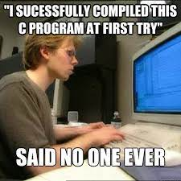

# Sintaxis y comentarios

En esta sección vamos a comprender el uso de `#include <stdio.h>` y como empezar a escribir nuestro primer código en C.

## Estructura básica

Vamos a desgranar la estructura básica de un programa en C para entender que hace cada instrucción.

~~~c
    #include <stdio.h>  // Inclusión de una biblioteca estándar

    int main() {
        printf("¡Hola, mundo!");  // Imprime un mensaje
        return 0;  // Retorna un valor al sistema operativo
    }
~~~

1. `#include <stdio.h>`: es una directiva de preprocesador (que también incluye C++). Indica al preprocesador que incluya el contenido del archivo "stdio.h" en el lugar donde está la directiva antes de que se realice la compilación.
   - `#include`: Es una directiva que le dice al compilador que incluya el contenido de un archivo específico en ese punto del código
   - `<stdio.h>`: Es el nombre del archivo de encabezado (o "header file") que se incluirá.

> :woman_teacher: **EXPLICACIÓN**
> `stdio.h` es una parte de la biblioteca estándar de C y se traduce como "standard input-output header"

2. `int main() {`: Es el comienzo de todos los programas en C, siempre es necesario tener una función `main`
   - `int`: es un tipo de dato que veremos más adelante pero en este caso nos indica que la función `main` devuelve un número entero (int).
   - `main()`: es el nombre de una función especial en C. Es el lugar donde comienza la ejecución del programa. Los paréntesis después de main indican que es una función. Los paréntesis pueden contener argumentos (también conocidos como parámetros) que la función puede aceptar.

> :pencil: **NOTA**
> En el caso de la función `main`, a menudo verás dos argumentos comunes: `int argc, char *argv[]`, que se utilizan para pasar argumentos de línea de comando al programa. Sin embargo, si un programa no necesita argumentos de línea de comando, estos pueden omitirse y los paréntesis se dejarían vacíos, como en `main()`.

   - `{}`: indican el inicio y el cierre de la función.

1. `printf("¡Hola, Skilly!");`: Impime el mensaje "Hola, Skilly"
   - `printf()`: Es una función básica de C, definida dentro de `stdio.h`, cuya finalidad es imprimir texto o valores en pantalla o consola. Dentro de los paréntesis puedes poner el texto que quieras imprimir o la variable para ver el valor
2. `return 0;`: devuelve un código de estado que indica como acabó el programa.
    Puedes ver más sobre el return en la [siguiente sección](#return).
3. `}`: cierre de la función.

> :warning: **ADVERTENCIA**
> Espero que llegados a este punto te hayas dado cuenta de una parte fundamental de la sintaxis de C...
>
> Eso es! **TODAS LAS INSTRUCIONES TIENEN QUE TERMINAR CON PUNTO Y COMA ( ; )**
> Si no utilizas un `;` al final de una instrucción en C, recibirás un error de compilación ya que el compilador no sabrá dónde termina una instrucción y dónde comienza la siguiente, lo que puede llevar a interpretaciones erróneas del código.
>

## Return

En C, return es una palabra clave que se utiliza dentro de una función para finalizar su ejecución y, opcionalmente, devolver un valor al lugar desde donde se llamó la función.

### Uso básico de `return`

- **Finalizar la ejecución de una función**: Una vez que se alcanza la instrucción return, la función deja de ejecutarse y el control vuelve al punto desde donde fue llamada.
- **Devolver un valor**: return puede ser seguido de una expresión o valor, el cual será el valor devuelto por la función

~~~c
int numero(int num) {
    return num;
}
~~~

### `return` en el `main()`

En la función main(), que es el punto de entrada de un programa en C, la instrucción return devuelve un código de estado al sistema operativo:

- **return 0;** generalmente indica que el programa se ejecutó con éxito.
- **Un valor distinto de cero** generalmente indica un error o un estado especial.

#### Valores predefinidos para `return`

1. **EXIT_SUCCESS**:
   1. Indica que el programa terminó con éxito.
   2. Normalmente tiene un valor de 0.
   3. Debes incluir el encabezado `stdlib.h` para usar EXIT_SUCCESS.
2. **EXIT_FAILURE**:
   1. Indica que el programa terminó debido a un error o problema.
   2. Su valor exacto puede variar, pero en muchos sistemas es 1.
   3. También debes incluir `stdlib.h` para usar EXIT_FAILURE.

Vamos a ver un ejemplo:

~~~c
//importamos las librerias necesarias
#include <stdio.h>
#include <stdlib.h>

int main() {
    // ... tu código ...

    if (alguna_condicion_de_error) {
        return EXIT_FAILURE;
    }

    return EXIT_SUCCESS;
}
~~~

Dicho esto, es válido y común ver simplemente return 0; para indicar éxito y return 1; (o algún otro número distinto de cero) para indicar un error. Sin embargo, usar EXIT_SUCCESS y EXIT_FAILURE puede hacer que el código sea más legible y portátil entre diferentes plataformas.

### Funciones `void`

Aún no hemos visto que son las funciones pero para explicar estos conceptos te haré una pequeña introducción:

Una función es un bloque de código que realiza una tarea específica. Agrupar código relacionado en funciones facilita la reutilización, el mantenimiento y la organización del código. Cada función tiene un nombre y puede ser llamada (o "invocada") desde otras partes del programa.

> :books: **PARA SABER MÁS**
> Puedes echar un vistazo a la sección de [Funciones en C]() y luego continuar desde aquí

Ahora que ya sabes lo básico sobre funciones te hablaré de como utilizar el `return` en funciones `void`
Las funciones que tienen un tipo de retorno void no devuelven un valor. Sin embargo, aún puedes usar la instrucción return por sí sola para salir de la función antes de que llegue al final.

~~~c
void imprimirMensaje(int edad) {
    if (edad < 0) {
        printf("Edad no válida.\n");
        return;  // Finaliza la función aquí
    }
    printf("La edad ingresada es: %d\n", edad);
}
~~~

### ¿Que pasa si no uso `return`?

En el punto anterior hemos visto que las funciones `void` no tienen por que llevar `return` pero.. ¿en el resto de funciones que pasa si no lo ponemos?

La respuesta es fácil, el comportamiento es indefinido. Esto significa que cualquier cosa podría suceder, desde devolver un valor basura hasta causar errores en la ejecución. ¿Sorprendid@ :wink:?

Vale y ¿qué pasa si no pongo `return` en el `main()`? Esta respuesta si te va a sorprender: no debería de pasar nada, el estándar C99 y posteriores nos dicen que es equivalente a `return 0;` pero esto no es una excusa para no ponerlo.

Como es mejor verlo para creerlo, vamos a ver que error nos dá si no utilizamos `return` en una función que debería llevarlo.

~~~sh
    warning: control reaches end of non-void function [-Wreturn-type]
~~~

Si aún así decides ignoralo y ejecutar el programa, la función podría devolver un valor basura (es decir, cualquier valor que estuviera en el lugar de memoria donde se espera el valor de retorno).

> :white_check_mark: **RECOMENDADO**
> Escribir `return 0;` al final del main para indicar que ha terminado de forma éxitosa.
>
> :heavy_exclamation_mark: **NO RECOMENDADO**
> no hacer caso a la recomendación :angry:

> :books: **PARA SABER MÁS**
> ¿Qué es el estándar C99?
> se refiere a una versión específica del estándar para el lenguaje de programación C, ratificado en 1999 por el comité de estándares ISO/IEC. El estándar completo se conoce como ISO/IEC 9899:1999.

### Consideraciones extra

- **Puedes tener múltiples instrucciones return**: Es posible tener varios puntos de salida en una función, aunque debes usarlo con cuidado para no complicar demasiado el flujo de la función.
- **Expresiones con return**: La expresión que sigue a return (si hay alguna) se evalúa completamente antes de que se devuelva el valor.
- **Valores de retorno y eficiencia**: A menudo, los valores devueltos por una función se almacenan en registros (en lugar de en la memoria), lo que es eficiente desde el punto de vista del rendimiento.

## Comentarios

Los comentarios son partes de un programa que no se ejecutan pero son **NECESARIOS** para proporcionar información adicional sobre el funcionamiento del código

> :gift_heart: **CONSEJO**
> Utiliza siempre comentarios para explicar partes de tu código y hacerle más legible para otros programadores :wink:

### Comentarios en línea

En C, cualquier texto que siga a // en una línea se considera un comentario y es ignorado por el compilador.

~~~c
// Esto es un comentario de una sola línea.
int x = 10;  // Este es otro comentario de una sola línea.
~~~

### Comentarios de bloque

Los comentarios que abarcan varias líneas en C comienzan con `/*` y terminan con `*/`. Todo el texto entre estos delimitadores se considera un comentario.

~~~c
/*
Este es un comentario
que abarca varias
líneas en C.
*/
int y = 20;
~~~

### Consideraciones extra

#### Recomendaciones y usos

- Documentación: Describe la funcionalidad del código, parámetros de funciones, retornos, propósitos de variables, etc.
- Depuración: Temporalmente puedes "comentar" partes del código que no deseas ejecutar durante la depuración o pruebas.
- Metainformación: Proporcionar detalles como el autor del código, fecha de creación, modificaciones, etc.
- Claridad: Los comentarios deben ser claros y concisos. El objetivo es facilitar la comprensión del código, no complicarlo.
- Evitar redundancia: No es necesario comentar cada línea. Si el código es autoexplicativo, no necesita un comentario.
- Actualización: Si cambias la funcionalidad del código, asegúrate de actualizar también los comentarios relevantes.

#### Precauciones

- No anides comentarios de múltiples líneas. Por ejemplo, el siguiente código causará un error:

~~~c
/*
  Comentario principal.
  /* Este comentario anidado causará un error. */
*/
~~~

- Ten cuidado con los comentarios de una sola línea (//) si estás trabajando en un código que también debe ser compatible con el estándar ANSI C (C89/C90), ya que este estándar no los reconoce. En ese caso, es preferible usar únicamente comentarios de múltiples líneas `(/* ... */)`.
