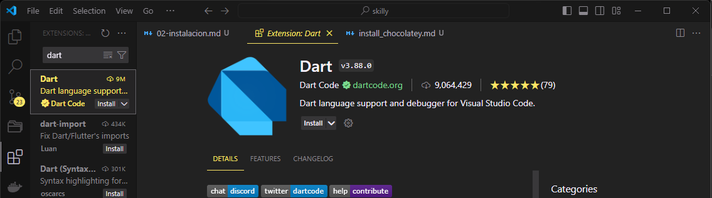

# Instalación y configuración de Dart

> :warning: **ADVERTENCIA**
> Hay muchas formas de instalar Dart dependiendo del sistema operativo que utili
ces.
> En este tutorial **nos enfocaremos en Linux (Ubuntu) y Windows 11**. 
>
> En cuanto al ide o editor de código **nos enfocaremos en configurar VScode**
>
> Si necesitas ayuda para instalar y configurar Dart en otro sistema operativo y/o ide escríbenos a **hola@skilly.es** o por Whatsapp.

## Instalación

> :woman_teacher: **EXPLICACIÓN**
> ¿Qué es Dart SDK?
> 

### Windows

> :sparkles: **IMPORTANTE**
> Es imprescindible tener instalado Chocolatey en Windows para seguir este tutorial
> Si quires saber como instalar Chocolatey puedes [seguir este tutorial](../../../install_chocolatey.md)

1. Usando Chocolatey, instalar Dart SDK

~~~ps
choco install dart-sdk
~~~

2. Comprobar instalación

~~~ps
dart --version
~~~

### Ubuntu

1. Actualiza los repositorios del sistema
   
   ~~~sh
   sudo apt-get update
   ~~~
2. Instalar apt-transport-https
   
   ~~~sh
   sudo apt-get install apt-transport-https
   ~~~
3. Agregar las claves de google a los repositorios del sistema

    ~~~sh
    sudo sh -c 'wget -qO- https://dl-ssl.google.com/linux/linux_signing_key.pub | apt-key add -'
    sudo sh -c 'wget -qO- https://storage.googleapis.com/download.dartlang.org/linux/debian/dart_stable.list > /etc/apt/sources.list.d/dart_stable.list'
    ~~~
4. Actualizar de nuevo los repositorios del sistema
   
   ~~~sh
   sudo apt-get update
   ~~~
5. Instalar dart
   
   ~~~sh
   sudo apt-get install dart
   ~~~
6. Verificar la instalación
   
   ~~~sh
   dart --version
   ~~~

## Configuración de VScode

Después de que hayamos instalado el SDK de Dart vamos a la sección de extensiones de nuestro Visual Studio Code, escribimos la palabra ‘Dart’ y le damos click a instalar a la extensión de Dart que nos proporciona herramientas para editar, refactorizar, ejecutar y recargar efectivamente aplicaciones móviles Flutter y aplicaciones web AngularDart.

[Enlace a la extension](https://marketplace.visualstudio.com/items?itemName=Dart-Code.dart-code)

