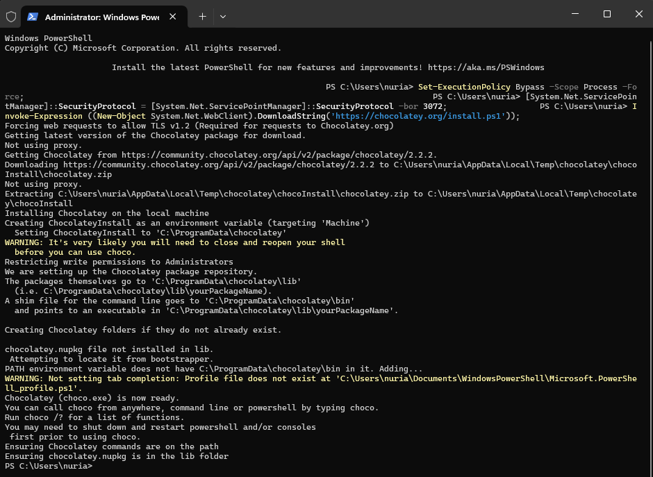
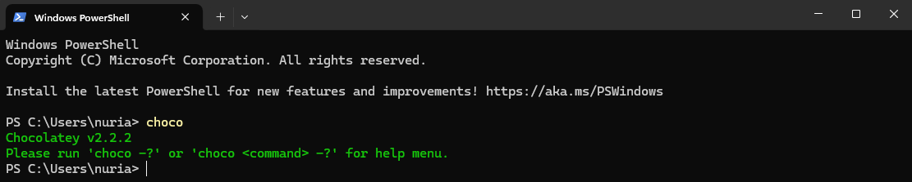

# Chocolatey en Windows 11

## ¿Qué es?

Chocolatey es un gestor de paquetes para Windows, similar a lo que apt-get es para Ubuntu o brew para macOS. Su principal propósito es automatizar el proceso de instalación, actualización, configuración y eliminación de software en la plataforma Windows. 

## Instalación

### Paso 1: Abrir PowerShell como Administrador

1. **Buscar PowerShell**: Presiona la tecla de Windows, y escribe “PowerShell”.
2. **Ejecutar como Administrador**: Haz clic derecho sobre “Windows PowerShell” y selecciona “Ejecutar como administrador” en el menú contextual.

### Paso 2: Configurar la Política de Ejecución

Ejecuta el siguiente comando en la ventana de PowerShell abierta como administrador para configurar la política de ejecución:

```powershell
Set-ExecutionPolicy Bypass -Scope Process -Force;
```

Este comando permite la instalación de scripts en esta sesión.

### Paso 3: Instalar Chocolatey

Utiliza el siguiente comando para instalar Chocolatey:

```powershell
[System.Net.ServicePointManager]::SecurityProtocol = [System.Net.ServicePointManager]::SecurityProtocol -bor 3072;
Invoke-Expression ((New-Object System.Net.WebClient).DownloadString('https://chocolatey.org/install.ps1'));
```



Este script descarga y ejecuta el instalador de Chocolatey desde su sitio web oficial.

### Paso 4: Cerrar y Reabrir PowerShell

Cierra la ventana de PowerShell y ábrela nuevamente como administrador para que los cambios tomen efecto y Chocolatey esté listo para usarse.

### Paso 5: Verificar la Instalación

Para verificar que Chocolatey se ha instalado correctamente, ejecuta el siguiente comando:

```powershell
choco
```



Si ves un mensaje con la versión de Chocolatey y algunas opciones de comando, la instalación ha salido bien

---

Con estos pasos, habrás instalado Chocolatey en Windows 11 y estarás listo para usar este gestor de paquetes para instalar y administrar software fácilmente.


