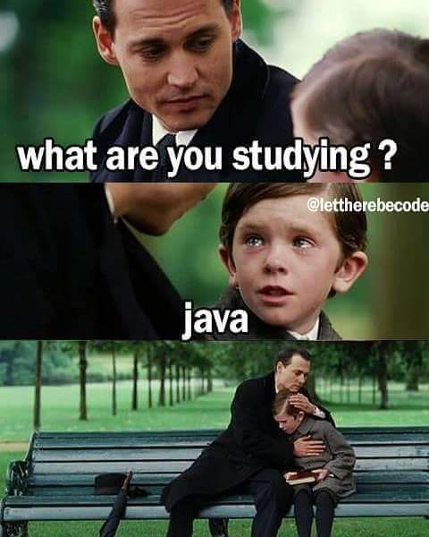
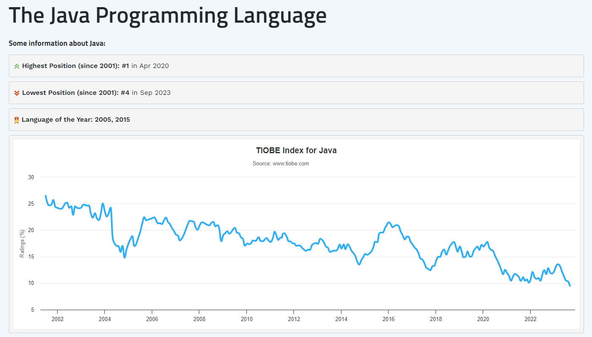
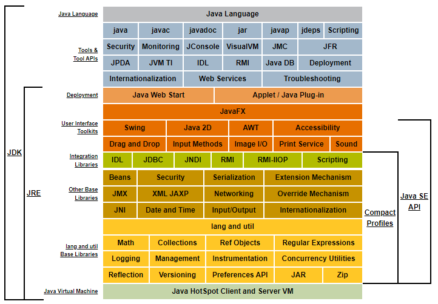

# Introducción a Java

En este curso vamos a ver que es Java, conocer su historia, como funciona por debajo, configuraremos el entorno y descubriremos recursos y algún cotilleo sobre Java

Antes de aprender a programar en un lenguaje es muy importante entender el conexto, conocer su nacimiento, su historia. Aún que nos parezca aburrido nos va a ayudar a entender que necesidad había para crear este lenguaje, cuantos años tiene, etc.

## ¿Qué es Java?

Java es un lenguaje de programación que, a pesar de tener 20 años, sigue siendo muy popular a día de hoy. Las claves de que Java siga vigente son su versatilidad gracias a la JVM (Java Virtual Machine), es organizado gracias a la OOP (Object-Oriented Programming), es bastante seguro en internet y super útil, con Java puedes desarrollar aplicaciones web, de escritorio e incluso de móvil con programación para Android(aunque ahora el standard es Kotlin).

> :pencil: **NOTA** Puedes echar un vistazo de la popularidad de los lenguajes de programación actuales en el [Índice TIOBE](https://www.tiobe.com/tiobe-index/)

### Historia de Java

James Gosling, un ingeniero de software canadiense, creó Java mientras trabajaba en Sun Microsystems a principios de la década de 1990 para abordar desafíos clave en el desarrollo de software, incluida la portabilidad, la seguridad, la simplicidad y la orientación a objetos.
Pero no fué solo James, tenía detrás el Green Team, una pequeña operación de Sun que contaba con 18 personas, sí solo 18 personas + James crearon Java ¡flipa! Se desarrolló como herramienta para un proyecto de [set-top-box](https://es.wikipedia.org/wiki/Decodificador_de_televisi%C3%B3n) y buscaban implementar una máquina virtual y un lenguaje con una estructura similar a C++. Con la llegada de [NetScape](https://es.wikipedia.org/wiki/Netscape_Communications_Corporation) reorientaron la plataforma hacia web y crearon HotJava, un navegador web modular y extensible.

Al principio se llamó OAK por un roble que había fuera de la oficina, después pasó a llamarse RED ya que OAK ya era una marca comercial registrada (adaptadores de tarjetas gráficas) pero... ¿ya no se llama RED, de donde viene Java?
Bien ¿te has fijado en el logo? Sí, es una taza de café y Java, en inglés, un término coloquial para referise al café asique te puedes imaginar de donde viene... ¡Los chicos del Green Team eran amantes del café!
Aparte de que, en cuestión de marketing, Java queda mejor, suena con más fuerza que RED y no se confunde con otros productos.

Como a todos nos gusta el chisme te voy a contar otras teorías alternativas, hay quien dice que puede tratarse de las iniciales de sus programadores (James Gosling, Arthur Van Hoff, Andy Bechtolsheim). Otros dicen que viene del acrónimo Just Another Vague Acronym ("solo otro acrónimo ambiguo más")... dejó a tu elección que teoría creer aunque la que más fuerza tiene es la historia basada en el café. 

> :star: **CURIOSIDAD** oye oye, otra cosa curiosa: los cuatro primeros bytes (el número mágico) de los archivos.class que genera el compilador, son en hexadecimal, 0xCAFEBABE

> :black_nib: **CITA** La promesa inicial de Gosling era Write Once, Run Anywhere (Escríbelo una vez, ejecútalo en cualquier lugar)
> Gracias James. :green_heart:

## Conceptos clave de Java

En esta sección vamos a ver un contexto general de Java y su sintaxis, empápate de todos los conceptos clave que iremos desarrollando más adelante

- Fundamentos de programación
  - Tipado: Java es un lenguaje fuertemente tipado, lo que significa que cada variable tiene un tipo de dato específico.
  - Tipos de datos: En Java, hay diversos tipos de datos que definen el rango y el tipo de valores que una variable puede contener.
  - Print: Cómo mostrar información en la consola utilizando System.out.println() y otras funciones relacionadas.
  - Comentarios: Cómo agregar comentarios en el código Java para hacerlo más legible y comprensible.
  - Variables: La forma de declarar y usar variables en Java, incluyendo la asignación de valores.
    - Scope de las variables: Cómo la visibilidad de una variable está limitada por su ámbito.
- Operaciones y control
  - Casting (casteo/parseo): Cómo convertir un tipo de dato en otro cuando sea necesario.
  - Operadores y expresiones: El uso de operadores para realizar cálculos y la creación de expresiones en Java.
  - Estructuras de control: Cómo usar estructuras como if, for, while, y switch para controlar el flujo del programa.
  - Métodos y funciones: Cómo definir, llamar y reutilizar bloques de código en Java.
- Programación orientada a objetos (POO)
  - Clases y objetos: Los conceptos fundamentales de la programación orientada a objetos, incluyendo cómo definir clases y crear objetos a partir de ellas.
  - Herencia: Cómo crear jerarquías de clases y heredar propiedades y métodos de una clase padre.
  - Encapsulación: La práctica de ocultar detalles de implementación y proporcionar una interfaz controlada para interactuar con objetos.
  - Polimorfismo:  Cómo una clase puede tener múltiples formas o comportamientos dependiendo del contexto.
- Características avanzadas
  - Garbage Collection: Cómo Java administra la memoria automáticamente y se encarga de eliminar objetos no utilizados.
  - Excepciones: Cómo manejar y gestionar situaciones excepcionales en el código de Java.

## JVM - Java Virtual Machine

Previamente hemos hablado de que Java es un lenguaje muy versátil gracias a la JVM pero ¿Qué es la JVM?

Es un programa que actua como un contenedor donde se ejecutará el programa escrito en Java. Como ya sabrás hay varios tipos de lenguajes (compilados, interpretados, precompilados y preprocesados) la diferencia principal entre ellos es la forma en que se ejecuta el código, en algunos es necesario compilar antes, otros se traducen en tiempo de ejecución y, en este caso, Java es precompilado, es decir, el código no pasa directamente a código máquina si no que se traduce a 'Bytecode' para ejecutarse en la máquina virtual JVM.
Esta capacidad es fundamental para que el lenguaje sea portable, dá igual en que máquina ejecutes Java mientras esté configurado la JVM.

> :back: **PARA ENTRAR EN CONTEXTO** si no recuerdas los tipos de lenguajes puedes echar un vistazo aqui:

### ¿Cómo funciona la JVM?

Te voy a explicar brevemente este diagrama:

1. Compilación: tenemos nuestro fichero .java que necesitamos compilar a Bytecode con la extensión .class, para este paso es necesario el compilador de Java (JAVAC)
2. Carga: cuando tienes los ficheros .class la JVM carga estos archivos en la memoria cuando ejecutas el programa.
3. Verificación: la JVM verifica el Bytecode para asegurarse de que cumpla la sintaxis de Java !No comprueba si tienes errores lógicos en la aplicación, solo comprueba sintaxis¡
4. Interprete o Compilación JIT (Just in Time): depende de la configuración de la JVM el Bytecode se puede ejecuutar de dos maneras:
   1. En la interpretación: la JVM lee y ejecuta el Bytecode directamente línea por línea, este proceso puede ser lento
   2. En compilación JIT: la JVM traduce el Bytecode a código nativo en tiempo de ejecución, este proceso es más rápido
5. Ejecución: el programa se ejecuta en la JVM y se encarga de gestionar la memoria , operaciones entrada/salida y demás operaciones.

## ¿Para qué sirve Java? ¿Dónde se usa?

Java a día de hoy se sigue usuando en multitud de proyectos ya que es un lenguaje muy versatil. Puedes encontrar programas escritos en Java en aplicaciones de escritorio empresariales, aplicaciones web (haciendo uso de Servlets y JSP), aplicaciones Android, BigData, Juegos y un sin fín de aplicaciones más.

> :back: **PARA ENTRAR EN CONTEXTO** si no sabes que son servlets y JSP puedes consultarlo aquí

> :star: **CURIOSIDAD** (os acordais de minijuegos.com? usaba java por debajo!)

## Frameworks

Empecemos recordando que son los frameworks, los frameworks son conjuntos de herramientas, bibliotecas y convenciones que proporcionan una estructura para desarrollar software de manera eficiente y coherente. Simplifican el proceso de desarrollo ya que proporcionan codigo preescrito y patrones de diseño para reutilizar.

En Java, podemos encontrar los siguientes frameworks:

- Spring: Es el framework más utlizado, proporciona una amplia gama de características, incluyendo la gestión de dependencias, seguridad, manejo de transacciones y creación de servicios web.
- Hibernate: Un framework de mapeo objeto-relacional (ORM) que simplifica la interacción con bases de datos relacionales. Permite a los desarrolladores trabajar con objetos en lugar de consultas SQL directas.
- JavaServer Faces (JSF): Diseñado para el desarrollo de interfaces de usuario web interactivas y ricas.
- Maven: Una herramienta de gestión de proyectos que facilita la construcción, el empaquetado y la gestión de dependencias en proyectos Java. Se utiliza para automatizar tareas de construcción
- Spark: Un framework de procesamiento de datos en memoria utilizado para análisis de big data y procesamiento de datos en tiempo real.
- Junit: Un framework de pruebas unitarias para Java que permite a los desarrolladores escribir y ejecutar pruebas automatizadas para sus aplicaciones.
- Google Web Toolkit (GWT): Permite a los desarrolladores escribir aplicaciones web en Java y compilarlas en JavaScript para su ejecución en navegadores web.

## ¿Java y Javascript tienen algo que ver?

No! pero te explico por qué, al principio, en la [Historia de Java](#historia-de-java), hemos hablado que fué cambiando de nombre y enfocandose un poco a la web, bien pues Javascript hizo lo mismo.
En inicio Javascript se llamaba Livescript pero la buena gente de Netscape, los desarrolladores de Javascript, vieron el auge que tenía Java y decidieron coger la misma ola. Decidieron utilizar 'Java' en su nombre para aprovechar la fama de Java y, al crear confusión, dar a conocer su lenguaje.

## Documentación

Este es una sección muy importante ya que siempre vamos a tener que recurrir a la documentación, aun que parezca que ya "dominas" Java en algún momento te hará falta consultar parámetros, funciones, etc en la documentación oficial. Dejo por aquí en [enlace a la documentación de Java 20](https://docs.oracle.com/en/java/javase/20/)

La web que nos ofrece Oracle para acceder a la documentación de Java... deja un poco que desear, es una web de aspecto algo "vintage" y puede ser tediosa de leer y compleja pero es importante acostumbrarse a leer este tipo de documentación por que muchos lenguajes o técnologías no tienen una documentación muy 'userfriendly'.
Como complemento, que no sustituto, a la documentación oficial tenemos la web de [W3Schools](https://www.w3schools.com/java), en esta web tenemos todos los conocimientos de nivel básico-medio para poder aprender Java con comodidad. Nos ofrece apartados para poder ejecutar y probar código Java directamente desde el navegador, multitud de ejemplos y proyectos que puedes realizar.
