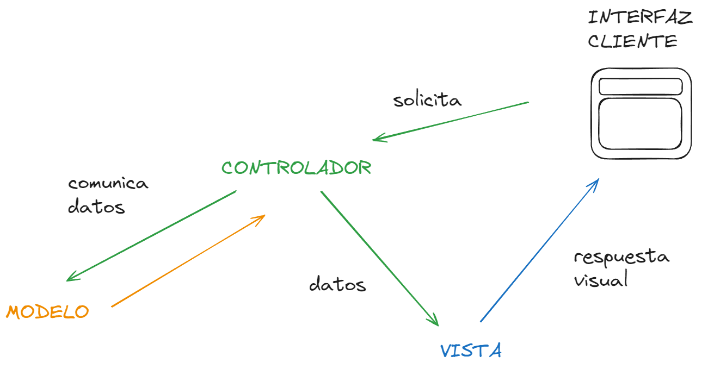

# Modelo - Vista - Controlador en Java

## ¿Qué es MVC?

El patrón Modelo-Vista-Controlador (MVC) es un patrón de diseño de software que divide una aplicación en tres componentes principales:

* Modelo: Contiene los datos y la lógica de negocio. El modelo se encarga de acceder a la base de datos, procesar datos, aplicar reglas de negocio y notificar a las vistas sobre los cambios en los datos.
* Vista: Presenta los datos del modelo al usuario. En una aplicación de escritorio, la vista sería la interfaz gráfica de usuario (GUI). La vista muestra la información y recibe la entrada del usuario, pero no realiza operaciones lógicas sobre los datos.
* Controlador: Actúa como intermediario entre el modelo y la vista. Responde a las entradas del usuario (por ejemplo, clics de botón), manipula el modelo y actualiza la vista.

## ¿Para qué sirve?

El patrón Modelo-Vista-Controlador (MVC) sirve para varios propósitos clave en el desarrollo de software.

* Separación de Responsabilidades
* Facilita la Prueba
* Flexibilidad y Reusabilidad
* Desarrollo Paralelo
* Desarrollo Paralelo
* Mejora la Mantenibilidad
* Soporte para Interfaces de Usuario Múltiples

## ¿Cómo se comunican entre sí?

El patrón Modelo-Vista-Controlador (MVC) se basa en la comunicación entre sus tres componentes principales: Modelo, Vista y Controlador. Vamos a desglosar cómo se comunican estos componentes para entenderlo mejor:

1. Modelo a Vista
   1. Mecanismo: El Modelo notifica a las Vistas suscritas cuando hay un cambio en los datos.
   2. Ejemplo: Imagina una aplicación de gestión de inventario. Cuando se añade un nuevo producto al inventario (Modelo), el Modelo notifica a la Vista de lista de productos para que actualice la visualización.
2. Vista a Controlador:
   1. Mecanismo: La Vista detecta las acciones del usuario (como clics en botones, entradas de texto) y notifica al Controlador. Esto generalmente se hace mediante el manejo de eventos.
   2. Ejemplo: En una aplicación de correo electrónico, cuando el usuario presiona el botón "Enviar" (Vista), esta acción se notifica al Controlador correspondiente, que luego procesa la solicitud.
3. Controlador a Modelo:
   1. Mecanismo: El Controlador interactúa directamente con el Modelo, enviando comandos para modificar los datos, basados en la interacción del usuario.
   2. Ejemplo: Siguiendo con la aplicación de correo electrónico, el Controlador tomará la acción de "Enviar" y actualizará el Modelo para añadir el nuevo correo electrónico al conjunto de datos enviados.
4. Controlador a Vista:
   1. Mecanismo: Aunque el Controlador no actualiza directamente la Vista, puede enviar comandos para cambiar la presentación o el estado de la Vista.
   2. Ejemplo: En una aplicación de juego, si el jugador pierde una vida, el Controlador puede instruir a la Vista para que muestre un mensaje de "Vida Perdida" o actualice la representación gráfica de las vidas restantes.



Veamos todo esto con un ejemplo completo. Imagina una aplicación de lista de tareas (TODO List) Tenemos los siguientes componentes: - Modelo: Contiene una lista de tareas - Vista: Muestra las tareas en una lista en la interfaz de usuario - Controlador: Gestiona la adición de nuevas tareas

Ahora vamos a simular la ejecución del programa:

* Cuando el usuario escribe una nueva tarea y presiona "Añadir" (Vista), esta acción se comunica al Controlador.
* El Controlador procesa esta acción y añade la nueva tarea al Modelo.
* El Modelo, al ser actualizado, notifica a la Vista (o Vistas) de la lista de tareas que hay un cambio.
* La Vista, al recibir la notificación, se actualiza mostrando la nueva tarea añadida.

## Ejemplo

Vale, nos dejamos de lío y vamos a la práctica. En este ejemplo vamos a ver como implementar MVC usando Java Swing pero tiene muchas más utilidades. Esta aplicación básica permite a un usuario actualizar un mensaje y ver el mensaje actualizado en la interfaz de usuario.

* Modelo: El Modelo almacena los datos. En este caso, simplemente guardará un mensaje.

```java
public class MensajeModelo {
    private String mensaje;

    public String getMensaje() {
        return mensaje;
    }

    public void setMensaje(String mensaje) {
        this.mensaje = mensaje;
    }
}
```

* Vista: La Vista muestra la representación visual de los datos. Aquí, creamos una simple interfaz de usuario con un campo de texto y un botón.

```java
import javax.swing.*;

public class MensajeVista extends JFrame {
    private JTextField txtMensaje = new JTextField(20);
    private JButton btnActualizar = new JButton("Actualizar");

    public MensajeVista() {
        JPanel panel = new JPanel();
        this.setDefaultCloseOperation(JFrame.EXIT_ON_CLOSE);
        this.setSize(300, 200);

        panel.add(txtMensaje);
        panel.add(btnActualizar);
        this.add(panel);
    }

    public String getMensaje() {
        return txtMensaje.getText();
    }

    public void setMensaje(String mensaje) {
        txtMensaje.setText(mensaje);
    }

    public void addActualizarListener(ActionListener escucharParaBoton) {
        btnActualizar.addActionListener(escucharParaBoton);
    }
}
```

* Controlador: El Controlador maneja la lógica que responde a las acciones del usuario y actualiza el Modelo.

```java
import java.awt.event.ActionEvent;
import java.awt.event.ActionListener;

public class MensajeControlador {
    private MensajeModelo modelo;
    private MensajeVista vista;

    public MensajeControlador(MensajeModelo modelo, MensajeVista vista) {
        this.modelo = modelo;
        this.vista = vista;

        this.vista.addActualizarListener(new ActionListener() {
            @Override
            public void actionPerformed(ActionEvent e) {
                modelo.setMensaje(vista.getMensaje());
                vista.setMensaje(modelo.getMensaje());
            }
        });
    }
}
```

* Principal: Aquí es donde se conectan el Modelo, la Vista y el Controlador.

```java
public class MVCEjemplo {
    public static void main(String[] args) {
        MensajeModelo modelo = new MensajeModelo();
        MensajeVista vista = new MensajeVista();
        MensajeControlador controlador = new MensajeControlador(modelo, vista);

        vista.setVisible(true);
    }
}+
```
