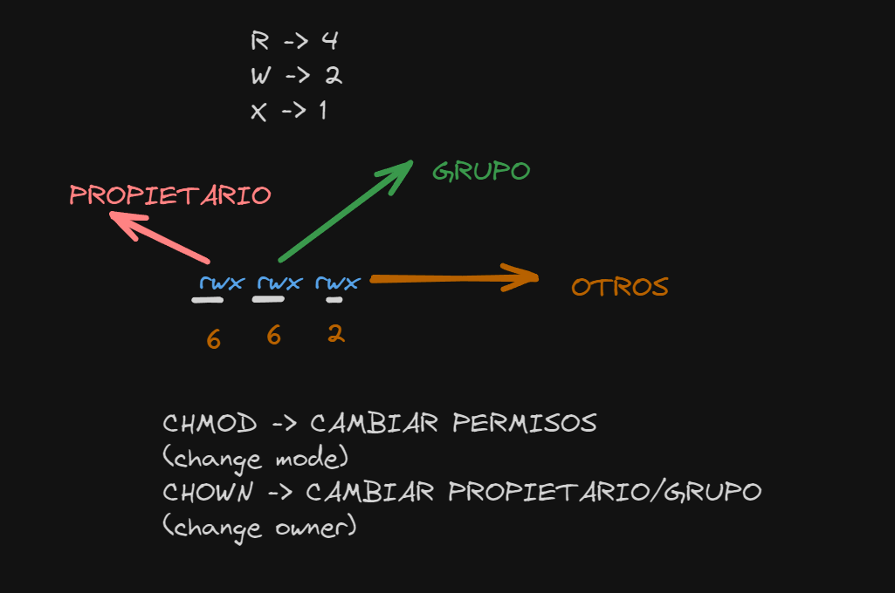

# Manejo de permisos de ficheros y rutas. Parte II

## 1. Crea un directorio llamado PermisosPrueba en tu directorio personal

## 2. Dentro de PermisosPrueba, crea un archivo llamado archivoPrueba.txt
 
## 3. Cambia los permisos del archivo archivoPrueba.txt para que solo el propietario pueda leer y escribir en el archivo

## 4. Verifica los permisos del archivo archivoPrueba.txt utilizando un comando

## 5. Cambia la ruta al directorio PermisosPrueba utilizando una ruta relativa desde tu directorio personal

## 6. Cambia los permisos del directorio PermisosPrueba para que solo el propietario pueda leer, escribir y ejecutar en el directorio

## 7. Muestra los permisos del directorio PermisosPrueba para verificar tus cambios

## 8. Intenta acceder al directorio PermisosPrueba utilizando otra cuenta de usuario (si es posible)

## 9. Regresa a tu directorio personal y elimina el directorio PermisosPrueba junto con su contenido

## 10. Crea un grupo nuevo llamado grupo_prueba, añade algunos usuarios a este grupo y cambia el grupo propietario de archivoPrueba.txt a grupo_prueba

## 11. Configura un cron job que cambie los permisos de un directorio específico a las 3 AM todos los días. Asegúrate de que solo el propietario pueda acceder durante la noche, pero todos los usuarios puedan leer los archivos durante el día.

## Pista sobre los permisos

## Punto de control
Reflexiona sobre lo que has aprendido y responde a las siguientes preguntas [Ver solución]():

- ¿Cuál es la diferencia entre una ruta absoluta y una relativa?
- ¿Cómo afectan los permisos de un directorio a los archivos y subdirectorios contenidos dentro?
- ¿Qué comando usaste para cambiar los permisos de un archivo o directorio?
- ¿Qué sucede cuando intentas acceder a un directorio sin los permisos necesarios?

